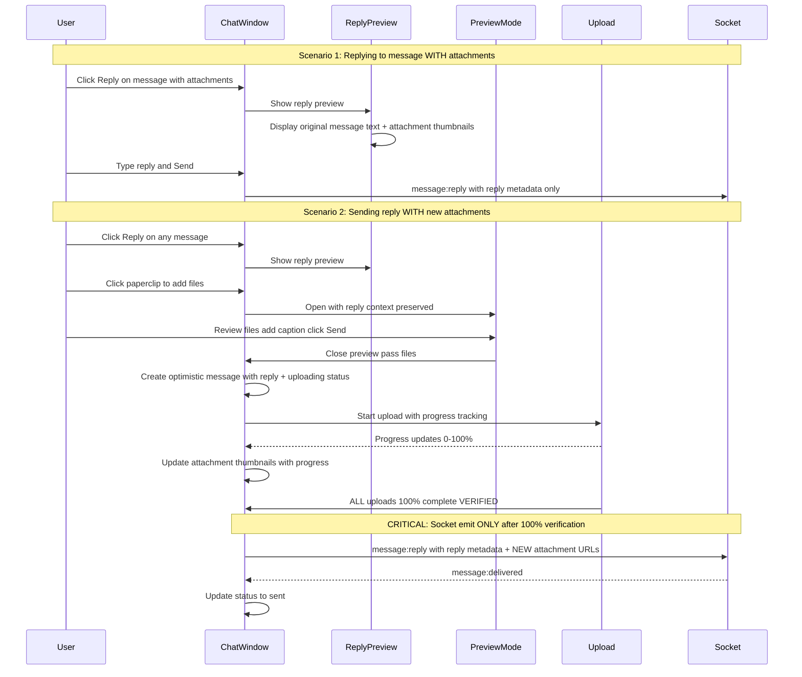
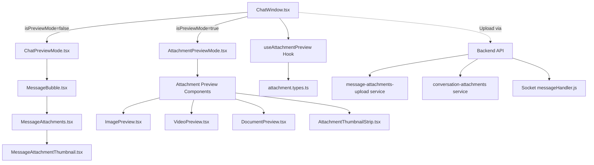
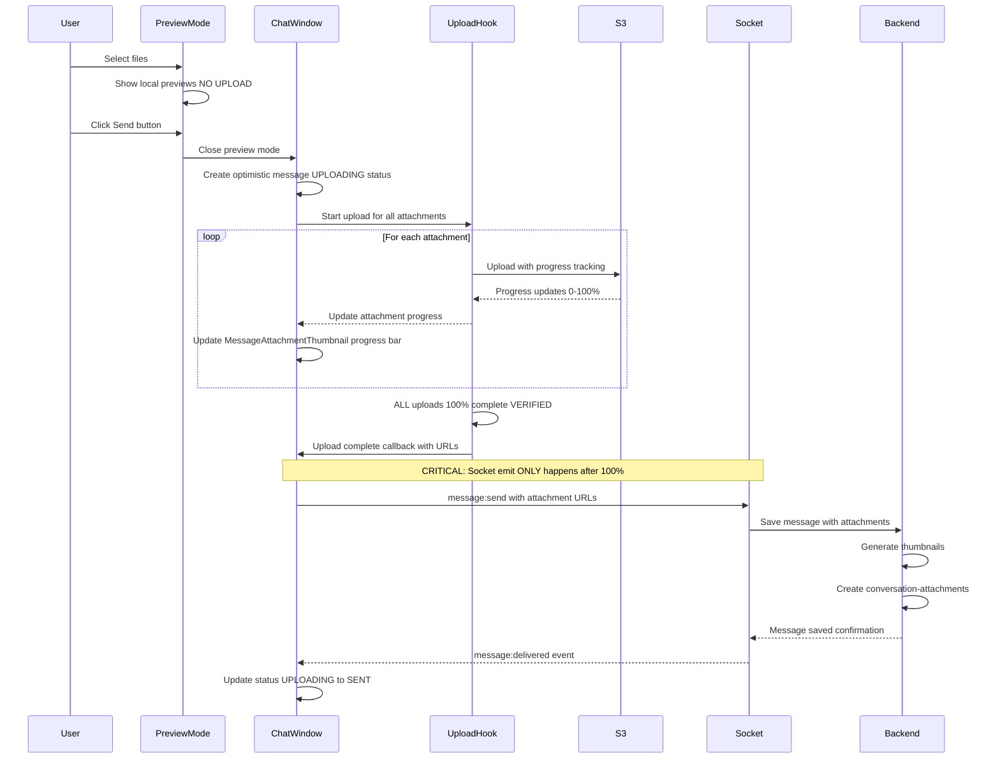

# Implementation Plan: Two-Component Chat System with Attachments

## Overview

This plan implements a sophisticated attachment system for the chat application, featuring a dual-mode interface that seamlessly switches between normal chat view and full-screen attachment preview mode. The system integrates with the existing backend architecture documented in [`ryland-lms-api/docs/chat-application/architecture.md`](ryland-lms-api/docs/chat-application/architecture.md).

## Key Feature: Upload Progress Indicators

**CRITICAL REQUIREMENT: Socket Emit ONLY After 100% Upload**

The socket server (`message:send` or `message:reply` event) is emitted **ONLY after ALL attachments reach 100% upload completion**. This is enforced by:
- Using `await uploadAttachments()` which blocks until Promise.all() resolves
- Promise.all() only resolves when EVERY attachment reaches 100%
- Explicit verification that all attachments have URLs and metadata before emit
- If any upload fails, the entire operation is aborted with error handling

**Upload Flow:**

1. **Select Files** → User selects files via paperclip button
2. **Preview Mode** → AttachmentPreviewMode opens showing LOCAL file previews (NO upload yet)
3. **Add Caption & Send** → User can add caption/text and click Send button
4. **Preview Closes** → AttachmentPreviewMode closes immediately
5. **Message Appears** → Message appears in ChatWindow with "uploading" status
6. **Progress Display:**

   - Overall progress bar above attachments showing total upload progress
   - Individual circular progress indicators on each attachment thumbnail
   - Progress updates in real-time (0% → 100%)
   - User sees progress but cannot cancel

7. **Upload Complete** → Once ALL attachments reach 100%:

   - **VERIFY**: All attachments have complete URLs and metadata
   - **THEN**: Socket emit happens with message + attachment URLs
   - **FINALLY**: Message status changes from "uploading" to "sent"
   - Progress indicators disappear

**Key Components Involved:**

- `useAttachmentUpload` hook emits progress updates
- `MessageAttachments` displays overall progress bar
- `MessageAttachmentThumbnail` shows individual circular progress on each thumbnail
- Message status includes `uploading: boolean` flag

## Reply Messages with Attachments

**The backend already supports attachments in reply messages** (see [`messageHandler.js`](ryland-lms-api/src/socket/handlers/messageHandler.js) lines 204-381, `MESSAGE.REPLY` event accepts `attachments` array).

### Two Scenarios for Reply + Attachments

**Scenario 1: Replying to a message that HAS attachments**

- ReplyPreview component should show thumbnail(s) of original message attachments
- User sees what they're replying to (text + attachment preview)

**Scenario 2: Sending a reply WITH new attachments**

- User clicks Reply on a message
- User clicks paperclip to add attachments
- AttachmentPreviewMode opens with reply context
- User sends reply message + new attachments
- Backend associates both reply metadata AND new attachments to the message

### Visual Examples

**Replying to message with attachments:**

```
┌─────────────────────────────────────────┐
│ Reply Preview (Above Input)             │
├─────────────────────────────────────────┤
│ ↰ Replying to John Smith                │
│ │ "Check these out!"                    │
│ │ [📷] [📷] 2 photos                    │  ← Shows attachment thumbnails
│ [X]                                      │
└─────────────────────────────────────────┘
```

**Sending reply with new attachments:**

```
┌─────────────────────────────────────────┐
│ Original Message                        │
│ ┌─────────────────────────────────────┐ │
│ │ ↰ Replying to: "What do you think?" │ │  ← Reply metadata
│ │                                     │ │
│ │ These look great!                   │ │  ← Reply text
│ │                                     │ │
│ │ ━━━━━━━━━━━━━━━━━━━━━━━━━━━━ 45%   │ │  ← Overall upload progress
│ │                                     │ │
│ │ [📷 45%] [📷 52%]                   │ │  ← NEW attachments in reply
│ │                                     │ │     with individual progress
│ │ 🔄 Uploading...                     │ │
│ └─────────────────────────────────────┘ │
└─────────────────────────────────────────┘
```

### Reply Attachments Flow Diagram



### Backend Support for Reply Attachments

The backend **already fully supports** reply messages with attachments (no backend changes needed):

**From [`messageHandler.js`](ryland-lms-api/src/socket/handlers/messageHandler.js) lines 204-381:**

```javascript
socket.on(MESSAGE.REPLY, async (data) => {
  const { recipientId, content, replyToMessageId, conversationId, tempId, attachments } = data;
  
  // Validates attachments (line 218-230)
  if (attachments && Array.isArray(attachments)) {
    for (const attachment of attachments) {
      if (!validateAttachment(attachment)) {
        socket.emit(MESSAGE.ERROR, { error: "Invalid attachment structure", tempId });
        return;
      }
    }
  }
  
  // Processes image attachments (line 264-268)
  const processedAttachments = await processImageAttachments(validatedAttachments, io.app, socket.user);
  
  // Creates message with reply metadata AND attachments (line 276-299)
  const messageData = {
    conversationId,
    senderId: socket.user._id,
    recipientId,
    content: content.trim(),
    reply: {
      messageId: replyToMessageId,
      content: originalMessage.content.length > 200 ? ... : originalMessage.content,
      messageType: 'text',
      senderId: originalMessage.senderId
    },
    attachments: allAttachments  // NEW attachments in the reply
  };
});
```

**What this means:**

- Backend accepts `attachments` array in `message:reply` event
- Backend processes images (generates thumbnails)
- Backend creates conversation-attachments records
- Backend emits to recipient with both reply metadata AND new attachments

**Frontend needs to:**

1. Update ReplyPreview to show original message attachments
2. Allow adding new attachments while replying
3. Upload new attachments with progress tracking
4. Emit `message:reply` with both reply metadata and new attachment URLs

## Architecture Diagram



## Backend Integration Points

### Existing Backend Services

**1. Message Attachments Upload Service** ([`ryland-lms-api/src/services/message-attachments-upload/message-attachments-upload.class.ts`](ryland-lms-api/src/services/message-attachments-upload/message-attachments-upload.class.ts))

- **Controller Actions:**
  - `createPresignedUrl`: Generate S3 presigned URLs for direct upload
  - `extractImageMetadata`: Extract dimensions from uploaded images
  - `generateThumbnail`: Create thumbnail versions (300x300px)
- **Attachment Limits:**
  - Images: 10MB max (jpeg, png, gif, webp, heic)
  - Documents: 25MB max (pdf, docx, xlsx)

**2. Conversation Attachments Model** ([`ryland-lms-api/src/models/conversation-attachments.model.ts`](ryland-lms-api/src/models/conversation-attachments.model.ts))

- Stores attachment references linked to messages
- Types: `"image" | "link" | "document"`
- Indexed by: conversationId, messageId, type, senderId

**3. Message Model with Attachments** ([`ryland-lms-api/src/models/messages.model.ts`](ryland-lms-api/src/models/messages.model.ts))

- `attachments` array embedded in messages
- Structure: `{ _id, type, url, metadata, uploadedAt }`
- Metadata types: `ImageMetadata`, `LinkMetadata`, `DocumentMetadata`

**4. Socket Message Handler** ([`ryland-lms-api/src/socket/handlers/messageHandler.js`](ryland-lms-api/src/socket/handlers/messageHandler.js))

- `message:send` event accepts `attachments` array
- Calls `processImageAttachments()` to generate thumbnails
- Calls `extractLinkPreviews()` for automatic link detection
- Creates conversation-attachment records after message save

### Upload Flow with Progress Indicators



**Key Flow Points:**

1. Files selected → Preview mode opens (NO upload)
2. Send clicked → Preview closes → Message appears in chat with "uploading" status
3. Upload starts → Progress bars visible on each attachment thumbnail
4. 100% complete → Socket emit → Status changes to "sent"

## File Structure

```
ryland-lms/
├── components/
│   └── messaging/
│       ├── ChatWindow.tsx                     (MODIFY - Add conditional rendering)
│       ├── ChatPreviewMode.tsx                (NEW - Extract from ChatWindow)
│       ├── AttachmentPreviewMode.tsx          (NEW - Full-screen viewer)
│       ├── attachments/
│       │   ├── ImagePreview.tsx               (NEW)
│       │   ├── VideoPreview.tsx               (NEW)
│       │   ├── DocumentPreview.tsx             (NEW)
│       │   ├── AttachmentThumbnail.tsx        (NEW)
│       │   └── AttachmentThumbnailStrip.tsx   (NEW)
│       └── messages/
│           ├── MessageBubble.tsx              (NEW - Extract from ChatWindow)
│           ├── MessageAttachments.tsx         (NEW - Reusable across messages & ReplyPreview)
│           └── MessageAttachmentThumbnail.tsx (NEW - Reusable with variant support)
│
├── lib/
│   ├── types/
│   │   ├── attachment.types.ts                (NEW)
│   │   └── messaging-store.types.ts           (MODIFY - Add attachments to Message)
│   └── utils/
│       └── attachment-validation.ts           (NEW - Client-side validation)
│
├── hooks/
│   ├── useAttachmentPreview.ts                (NEW - Preview mode logic)
│   └── useAttachmentUpload.ts                 (NEW - Upload management)
│
└── store/
    └── messaging-store.ts                     (MODIFY - Add attachment actions)
```

## Component Reusability Strategy

To avoid code duplication, **MessageAttachments** and **MessageAttachmentThumbnail** components are designed to be reusable across multiple contexts:

### MessageAttachments Component

**Used in:**

1. **Message Bubbles** (default variant) - Full-size thumbnails with upload progress
2. **ReplyPreview** (compact variant) - Small thumbnails, read-only, no progress
3. **Future contexts** - Any place that needs to display attachment thumbnails

**Key props for reusability:**

- `variant`: 'default' | 'compact' - Controls size
- `readonly`: boolean - Disables click interactions
- `showProgress`: boolean - Show/hide upload progress bar
- `maxDisplay`: number - Max thumbnails to show

### MessageAttachmentThumbnail Component

**Used in:**

1. **MessageAttachments** (called internally)
2. **Any custom attachment display** needs

**Key props for reusability:**

- `variant`: 'default' | 'compact' - Controls size (aspect-square vs w-10 h-10)
- `onClick`: optional - Makes thumbnail clickable
- Progress indicators scale with variant

**Visual Comparison:**

```
Default (Message Bubble):          Compact (ReplyPreview):
┌──────────────┐                   ┌─────┐ ┌─────┐ ┌─────┐
│              │                   │     │ │     │ │     │
│    IMAGE     │                   │ IMG │ │ IMG │ │ IMG │
│  (clickable) │                   │     │ │     │ │     │
│              │                   └─────┘ └─────┘ └─────┘
│  [Progress]  │                   10x10  readonly  no progress
└──────────────┘
aspect-square
with progress bar
```

This approach ensures:

- **Single source of truth** for thumbnail rendering
- **Consistent appearance** across the app
- **Easy updates** - change once, applies everywhere
- **Type safety** - shared types and props

## Phase 1: Type Definitions & Foundational Setup

### 1.1 Create Attachment Type Definitions

**File:** [`lib/types/attachment.types.ts`](lib/types/attachment.types.ts)

```typescript
// Attachment types matching backend
export type AttachmentType = "image" | "video" | "document" | "link";
export type UploadStatus = "pending" | "uploading" | "processing" | "complete" | "error";

// Image metadata (from backend ImageMetadata)
export interface ImageMetadata {
  filename: string;
  size: number;
  mimeType: string;
  width: number;
  height: number;
  thumbnail: string;  // S3 URL to thumbnail
}

// Document metadata (from backend DocumentMetadata)
export interface DocumentMetadata {
  filename: string;
  size: number;
  mimeType: string;
  pageCount?: number;
}

// Link metadata (from backend LinkMetadata)
export interface LinkMetadata {
  title: string;
  description: string;
  image?: string;
  siteName?: string;
  url: string;
}

// Video metadata (extension)
export interface VideoMetadata {
  filename: string;
  size: number;
  mimeType: string;
  duration?: number;
  width?: number;
  height?: number;
  thumbnail?: string;
}

// Pending attachment (client-only, before upload)
export interface PendingAttachment {
  id: string;
  file: File;
  type: AttachmentType;
  preview: string;  // Local blob URL for preview
  uploadStatus: UploadStatus;
  uploadProgress: number;  // 0-100
  error?: string;
  // After upload
  url?: string;
  metadata?: ImageMetadata | DocumentMetadata | VideoMetadata;
}

// Message attachment (from backend, after upload)
export interface MessageAttachment {
  _id: string;
  type: AttachmentType;
  url: string;
  metadata: ImageMetadata | LinkMetadata | DocumentMetadata | VideoMetadata;
  uploadedAt: Date;
}

// Preview mode state
export interface AttachmentPreviewState {
  isActive: boolean;
  attachments: MessageAttachment[] | PendingAttachment[];
  currentIndex: number;
  source: "message" | "pending";  // viewing vs adding
}
```

### 1.2 Update Message Type

**File:** [`lib/types/messaging-store.types.ts`](lib/types/messaging-store.types.ts)

Add to existing `Message` interface:

```typescript
export interface Message {
  // ... existing fields ...
  status: {
    sent: boolean;
    delivered: boolean;
    read: boolean;
    uploading?: boolean;  // ADD THIS - for messages with attachments being uploaded
  };
  reply?: {
    messageId: string;
    content: string;
    messageType: 'text';
    senderId: string;
    senderName: string;
    attachments?: MessageAttachment[];  // ADD THIS - original message attachments for preview
  };
  attachments?: MessageAttachment[];  // ADD THIS - new attachments in THIS message
  pendingAttachments?: PendingAttachment[];  // ADD THIS - for upload progress tracking
}
```

**Key distinction:**

- `reply.attachments`: Attachments from the ORIGINAL message being replied to (for preview)
- `attachments`: NEW attachments being sent WITH the reply

### 1.3 Client-Side Validation Utilities

**File:** [`lib/utils/attachment-validation.ts`](lib/utils/attachment-validation.ts)

```typescript
// Matching backend ATTACHMENT_LIMITS
export const ATTACHMENT_LIMITS = {
  image: {
    maxSize: 10 * 1024 * 1024,  // 10MB
    allowedTypes: ["image/jpeg", "image/png", "image/gif", "image/webp"],
    extensions: ["jpg", "jpeg", "png", "gif", "webp"]
  },
  video: {
    maxSize: 50 * 1024 * 1024,  // 50MB
    allowedTypes: ["video/mp4", "video/quicktime", "video/webm"],
    extensions: ["mp4", "mov", "webm"]
  },
  document: {
    maxSize: 25 * 1024 * 1024,  // 25MB
    allowedTypes: ["application/pdf", "application/vnd.openxmlformats-officedocument.wordprocessingml.document"],
    extensions: ["pdf", "docx"]
  }
};

export const MAX_ATTACHMENTS_PER_MESSAGE = 10;

// Validation functions: validateAttachment(), getAttachmentType(), formatFileSize()
```

## Phase 2: Core Hooks

### 2.1 Attachment Upload Hook

**File:** [`hooks/useAttachmentUpload.ts`](hooks/useAttachmentUpload.ts)

**Responsibilities:**

- Request presigned URLs from backend
- Upload files directly to S3 with **real-time progress tracking**
- Extract image metadata after upload
- Handle upload errors and retries
- **Emit progress updates to parent components** (ChatWindow/MessageAttachments)

**Key Methods:**

```typescript
interface UseAttachmentUpload {
  uploadAttachments: (
    files: File[], 
    onProgress: (attachmentId: string, progress: number) => void
  ) => Promise<MessageAttachment[]>;
  
  cancelUpload: (attachmentId: string) => void;
  
  uploadingAttachments: Map<string, number>; // attachmentId -> progress %
}
```

**Implementation with Progress Callbacks:**

```typescript
export function useAttachmentUpload() {
  const [uploadingAttachments, setUploadingAttachments] = useState<Map<string, number>>(new Map());
  
  /**
   * Upload multiple attachments to S3 with progress tracking
   * 
   * CRITICAL: This function only resolves when ALL attachments reach 100%
   * The returned array will contain complete MessageAttachment objects with URLs
   * 
   * @returns Promise that resolves ONLY when all uploads are 100% complete
   */
  const uploadAttachments = async (
    files: File[],
    onProgress: (attachmentId: string, progress: number) => void
  ): Promise<MessageAttachment[]> => {
    const uploadPromises = files.map(async (file) => {
      const attachmentId = generateId();
      
      try {
        // 1. Get presigned URL (0% -> 5% progress)
        onProgress(attachmentId, 0);
        const response = await feathersClient.service('message-attachments-upload').create({
          controller: 'createPresignedUrl',
          filename: file.name,
          fileSize: file.size,
          mimeType: file.type,
          attachmentType: getAttachmentType(file)
        });
        onProgress(attachmentId, 5);
        
        // 2. Upload to S3 with real-time progress (5% -> 90%)
        await axios.put(response.signedUrl, file, {
          onUploadProgress: (progressEvent) => {
            const progress = 5 + Math.round((progressEvent.loaded * 85) / progressEvent.total);
            onProgress(attachmentId, progress);
          }
        });
        onProgress(attachmentId, 90);
        
        // 3. Extract metadata for images (90% -> 95%)
        let metadata = response.metadata;
        if (getAttachmentType(file) === 'image') {
          const metadataResponse = await feathersClient.service('message-attachments-upload').create({
            controller: 'extractImageMetadata',
            url: response.objectUrl
          });
          metadata = { ...metadata, ...metadataResponse };
        }
        onProgress(attachmentId, 95);
        
        // 4. Final verification - ensure we have URL and metadata
        if (!response.objectUrl || !metadata) {
          throw new Error('Upload incomplete - missing URL or metadata');
        }
        
        // 5. Mark as 100% ONLY when completely done
        onProgress(attachmentId, 100);
        
        // Return complete attachment object
        return {
          _id: attachmentId,
          type: getAttachmentType(file),
          url: response.objectUrl,      // Guaranteed to exist
          metadata,                       // Guaranteed to exist
          uploadedAt: new Date()
        };
        
      } catch (error) {
        onProgress(attachmentId, -1);  // -1 indicates error
        throw error;
      }
    });
    
    // Wait for ALL uploads to complete (Promise.all)
    // This only resolves when every single upload reaches 100%
    const results = await Promise.all(uploadPromises);
    
    return results;
  };
  
  return { uploadAttachments, uploadingAttachments };
}
```

**Progress Flow:**

- **0-5%**: Getting presigned URL from backend
- **5-90%**: Uploading file to S3 (real-time progress updates)
- **90-95%**: Extracting metadata (images only - dimensions, etc.)
- **95-100%**: Final verification (URL exists, metadata valid)
- **100%**: Upload COMPLETE - attachment has URL and metadata
- **-1%**: Error occurred during upload

**Critical Flow Guarantee:**

The `uploadAttachments()` function uses `Promise.all()`, which means it ONLY resolves when EVERY single attachment reaches 100%:

```typescript
// Code execution PAUSES at this line until ALL uploads reach 100%
await uploadAttachments(files, onProgress);

// This line ONLY executes AFTER 100% completion of ALL attachments
socket.emit('message:send', { attachments });
```

**Why this matters:**

- Backend expects valid S3 URLs in the `attachments` array
- If we emit before 100%, URLs might be incomplete or missing
- The `await` keyword guarantees we WAIT for completion
- UI shows progress in real-time, but socket emit waits for 100%
- No race conditions - socket emit happens AFTER uploads complete

**Visual Timeline:**

```
User clicks Send
      ↓
Message appears in chat (optimistic, uploading status)
      ↓
━━━ UPLOAD PHASE (progress 0% → 100%) ━━━
      ↓
Attachment 1: [████████░░] 80%
Attachment 2: [███████░░░] 70%
Attachment 3: [█████░░░░░] 50%
      ↓
Attachment 1: [██████████] 100% ✓
Attachment 2: [██████████] 100% ✓
Attachment 3: [██████████] 100% ✓
      ↓
ALL complete? YES!
Verify URLs exist? YES!
      ↓
━━━ SOCKET EMIT (happens AFTER 100%) ━━━
      ↓
socket.emit('message:send' or 'message:reply')
      ↓
Backend receives complete data
      ↓
Status changes: uploading → sent
```

### 2.2 Attachment Preview Hook

**File:** [`hooks/useAttachmentPreview.ts`](hooks/useAttachmentPreview.ts)

**Responsibilities:**

- Manage preview mode state
- Handle navigation between attachments
- Handle add more functionality
- Handle download functionality

**State:**

```typescript
interface AttachmentPreviewHook {
  previewState: AttachmentPreviewState;
  openPreview: (attachments: MessageAttachment[], index: number) => void;
  closePreview: () => void;
  navigateNext: () => void;
  navigatePrevious: () => void;
  navigateToIndex: (index: number) => void;
  downloadAttachment: (attachment: MessageAttachment) => void;
  addMoreAttachments: (files: File[]) => Promise<void>;
  removeAttachment: (attachmentId: string) => void;
}
```

## Phase 3: Component Development

### 3.1 Refactor ChatWindow (Parent Component)

**File:** [`components/messaging/ChatWindow.tsx`](components/messaging/ChatWindow.tsx)

**Changes:**

1. Extract message rendering to `MessageBubble` component
2. Extract main chat view to `ChatPreviewMode` component
3. Add state for attachment preview mode
4. Add conditional rendering logic

**New State:**

```typescript
const [isPreviewMode, setIsPreviewMode] = useState(false);
const [pendingAttachments, setPendingAttachments] = useState<PendingAttachment[]>([]);
const [viewingAttachments, setViewingAttachments] = useState<MessageAttachment[]>([]);
const [currentAttachmentIndex, setCurrentAttachmentIndex] = useState(0);
```

**Conditional Rendering:**

```typescript
{isPreviewMode ? (
  <AttachmentPreviewMode
    attachments={pendingAttachments.length > 0 ? pendingAttachments : viewingAttachments}
    currentIndex={currentAttachmentIndex}
    isViewingMode={viewingAttachments.length > 0}
    onClose={() => setIsPreviewMode(false)}
    onNavigate={setCurrentAttachmentIndex}
    onAddMore={handleAddMoreAttachments}
    onRemove={handleRemoveAttachment}
    onSend={handleSendWithAttachments}
  />
) : (
  <ChatPreviewMode
    conversationId={conversationId}
    conversationName={conversationName}
    messages={messages}
    onAttachmentClick={handleAttachmentClick}
    onSendMessage={onSendMessage}
    {...otherProps}
  />
)}
```

**Upload Flow Handler:**

```typescript
const { uploadAttachments } = useAttachmentUpload();

const handleSendWithAttachments = async (caption: string, attachments: PendingAttachment[]) => {
  // 1. Close preview mode
  setIsPreviewMode(false);
  
  // 2. Create optimistic message with UPLOADING status
  const tempMessageId = generateTempId();
  const optimisticMessage: Message = {
    id: tempMessageId,
    conversationId,
    senderId: currentUserId,
    senderName: currentUserName,
    content: caption,
    timestamp: new Date(),
    status: {
      sent: false,
      delivered: false,
      read: false,
      uploading: true  // UPLOADING STATE
    },
    pendingAttachments: attachments.map(att => ({
      ...att,
      uploadStatus: 'uploading',
      uploadProgress: 0
    }))
  };
  
  // 3. Add to messages (user sees message immediately)
  addOptimisticMessage(optimisticMessage);
  
  // 4. Start upload with progress callbacks
  try {
    const uploadedAttachments = await uploadAttachments(
      attachments.map(a => a.file),
      (attachmentId, progress) => {
        // Update progress in real-time for each attachment
        updateAttachmentProgress(tempMessageId, attachmentId, progress);
      }
    );
    
    // 5. VERIFY: All uploads must be 100% complete at this point
    // uploadAttachments() only resolves when ALL attachments reach 100%
    const allComplete = uploadedAttachments.every(att => att.url && att.metadata);
    
    if (!allComplete) {
      throw new Error('Not all attachments uploaded successfully');
    }
    
    // 6. NOW send to socket (ONLY after 100% verification)
    socket.emit('message:send', {
      recipientId: participantId,
      content: caption,
      conversationId,
      attachments: uploadedAttachments,  // All have URLs now
      tempId: tempMessageId
    });
    
    // 7. Update message status from UPLOADING to SENT
    updateMessageStatus(tempMessageId, { uploading: false, sent: true });
    
  } catch (error) {
    // Handle upload error
    console.error('Upload failed:', error);
    updateMessageStatus(tempMessageId, { 
      uploading: false, 
      error: 'Upload failed' 
    });
  }
};
```

### 3.2 ChatPreviewMode Component

**File:** [`components/messaging/ChatPreviewMode.tsx`](components/messaging/ChatPreviewMode.tsx)

**Extract from ChatWindow:**

- Header with avatar and presence indicator
- Messages ScrollArea with `MessageBubble` components
- Typing indicator
- Reply preview
- Input area with file attachment button

**New File Attachment Flow:**

```typescript
const handleFileSelect = async (files: FileList) => {
  const fileArray = Array.from(files);
  
  // Validate files
  const validFiles = fileArray.filter(file => validateAttachment(file));
  
  if (validFiles.length === 0) {
    toast.error("No valid files selected");
    return;
  }
  
  // Create pending attachments
  const pending = await Promise.all(
    validFiles.map(file => createPendingAttachment(file))
  );
  
  // Open preview mode
  onEnterPreviewMode(pending);
};
```

### 3.3 MessageBubble Component

**File:** [`components/messaging/messages/MessageBubble.tsx`](components/messaging/messages/MessageBubble.tsx)

**Extract from ChatWindow lines 303-458:**

- Message bubble rendering
- Reply preview display
- Message status indicators
- Reaction display
- Quick actions (reply, delete)

**Add attachment display:**

```typescript
{message.attachments && message.attachments.length > 0 && (
  <MessageAttachments
    attachments={message.attachments}
    onAttachmentClick={(attachment, index) => onAttachmentClick(message.id, index)}
    messageId={message.id}
  />
)}
```

### 3.4 MessageAttachments Component (Reusable)

**File:** [`components/messaging/messages/MessageAttachments.tsx`](components/messaging/messages/MessageAttachments.tsx)

**Design Philosophy:** This component is designed to be **reusable across multiple contexts**:

1. Message bubbles (primary use case)
2. ReplyPreview component (compact mode)
3. Any other attachment display needs

**Props:**

```typescript
interface MessageAttachmentsProps {
  attachments?: MessageAttachment[];
  pendingAttachments?: PendingAttachment[];
  onAttachmentClick?: (attachment: MessageAttachment | PendingAttachment, index: number) => void;
  isUploading?: boolean;
  showProgress?: boolean;  // NEW - whether to show upload progress bar
  variant?: 'default' | 'compact';  // NEW - display mode
  maxDisplay?: number;  // NEW - max thumbnails to show (default: 4)
  readonly?: boolean;  // NEW - disable click interactions
}
```

**Implementation:**

```typescript
export function MessageAttachments({ 
  attachments, 
  pendingAttachments,
  onAttachmentClick, 
  isUploading = false,
  showProgress = true,
  variant = 'default',
  maxDisplay = 4,
  readonly = false
}: MessageAttachmentsProps) {
  // Use pendingAttachments if uploading, otherwise use regular attachments
  const displayAttachments = isUploading 
    ? pendingAttachments?.slice(0, maxDisplay) 
    : attachments?.slice(0, maxDisplay);
  const totalAttachments = isUploading ? pendingAttachments?.length : attachments?.length;
  const remainingCount = Math.max(0, (totalAttachments || 0) - maxDisplay);
  
  // Calculate overall progress
  const overallProgress = isUploading && pendingAttachments
    ? Math.round(
        pendingAttachments.reduce((sum, att) => sum + att.uploadProgress, 0) / 
        pendingAttachments.length
      )
    : 100;
  
  // Size variants
  const sizeClasses = {
    default: 'mt-2',
    compact: 'mt-1.5'
  };
  
  return (
    <div className={sizeClasses[variant]}>
      {/* Overall progress bar for uploading state */}
      {isUploading && showProgress && (
        <div className="mb-2 flex items-center gap-2">
          <div className="flex-1 h-1.5 bg-gray-200 rounded-full overflow-hidden">
            <div 
              className="h-full bg-blue-500 transition-all duration-300"
              style={{ width: `${overallProgress}%` }}
            />
          </div>
          <span className="text-xs text-gray-500">{overallProgress}%</span>
        </div>
      )}
      
      {/* Attachment grid */}
      <div className="grid gap-1" style={{
        gridTemplateColumns: (totalAttachments || 0) === 1 ? '1fr' : 'repeat(2, 1fr)'
      }}>
        {displayAttachments?.map((attachment, index) => (
          <MessageAttachmentThumbnail
            key={attachment._id || attachment.id}
            attachment={attachment}
            onClick={!readonly && !isUploading ? () => onAttachmentClick?.(attachment, index) : undefined}
            showOverlay={index === maxDisplay - 1 && remainingCount > 0}
            overlayCount={remainingCount}
            isUploading={isUploading && 'uploadProgress' in attachment}
            uploadProgress={'uploadProgress' in attachment ? attachment.uploadProgress : undefined}
            variant={variant}
          />
        ))}
      </div>
    </div>
  );
}
```

**Usage Examples:**

```typescript
// In message bubble (default)
<MessageAttachments 
  attachments={message.attachments}
  onAttachmentClick={handleClick}
  isUploading={message.status.uploading}
  pendingAttachments={message.pendingAttachments}
/>

// In ReplyPreview (compact, readonly)
<MessageAttachments 
  attachments={replyMessage.attachments}
  variant="compact"
  maxDisplay={3}
  readonly={true}
  showProgress={false}
/>
```

### 3.5 Upload Progress Visual Example

**What the user sees during upload:**

```
┌─────────────────────────────────────────┐
│ John Smith (You)                 10:45 AM│
│ ┌─────────────────────────────────────┐ │
│ │ Check out these photos!             │ │
│ │                                     │ │
│ │ ━━━━━━━━━━━━━━━━━━━━━━━━━━━━ 67%   │ │  ← Overall progress
│ │                                     │ │
│ │ ┌────────┐ ┌────────┐              │ │
│ │ │ [IMG]  │ │ [IMG]  │              │ │
│ │ │  45%   │ │  89%   │              │ │  ← Individual progress
│ │ │ ●──────│ │ ●●●●●──│              │ │     on each thumbnail
│ │ └────────┘ └────────┘              │ │
│ │                                     │ │
│ │ 🔄 Uploading...                     │ │  ← Status indicator
│ └─────────────────────────────────────┘ │
└─────────────────────────────────────────┘

After upload complete (100%):

┌─────────────────────────────────────────┐
│ John Smith (You)                 10:45 AM│
│ ┌─────────────────────────────────────┐ │
│ │ Check out these photos!             │ │
│ │                                     │ │
│ │ ┌────────┐ ┌────────┐              │ │
│ │ │ [IMG]  │ │ [IMG]  │              │ │  ← No progress bars
│ │ │        │ │        │              │ │
│ │ └────────┘ └────────┘              │ │
│ │                                     │ │
│ │ 10:45 AM ✓                          │ │  ← Sent checkmark
│ └─────────────────────────────────────┘ │
└─────────────────────────────────────────┘
```

### 3.6 ReplyPreview Component Updates

**File:** [`components/messaging/ReplyPreview.tsx`](components/messaging/ReplyPreview.tsx) (MODIFY)

**Reuse MessageAttachments component instead of duplicating code:**

```typescript
import { MessageAttachments } from './messages/MessageAttachments';  // ADD IMPORT

interface ReplyPreviewProps {
  senderName: string;
  content: string;
  isOwnMessage: boolean;
  attachments?: MessageAttachment[];  // ADD THIS
  onClose: () => void;
}

export function ReplyPreview({
  senderName,
  content,
  isOwnMessage,
  attachments,
  onClose,
}: ReplyPreviewProps) {
  const truncatedContent = content.length > 100 
    ? content.substring(0, 100) + "..." 
    : content;
  const displayName = isOwnMessage ? "yourself" : senderName;

  return (
    <div className="px-6 py-3 bg-gradient-to-b from-white to-gray-50/50 border-t border-gray-200">
      <div className="flex items-start gap-3">
        <div className="flex items-start gap-2 flex-1 min-w-0">
          <div className="flex-shrink-0 pt-0.5">
            <CornerUpLeft className={cn(
              "h-4 w-4",
              isOwnMessage ? "text-green-500" : "text-blue-500"
            )} />
          </div>
          
          <div className={cn(
            "flex-1 min-w-0 pl-3 border-l-[3px]",
            isOwnMessage ? "border-green-500" : "border-blue-500"
          )}>
            <p className={cn(
              "text-[11px] font-semibold mb-1",
              isOwnMessage ? "text-green-600" : "text-blue-600"
            )}>
              Replying to {displayName}
            </p>
            <p className="text-[13px] text-gray-700 truncate">
              {truncatedContent}
            </p>
            
            {/* REUSE MessageAttachments component in compact mode */}
            {attachments && attachments.length > 0 && (
              <MessageAttachments
                attachments={attachments}
                variant="compact"
                maxDisplay={3}
                readonly={true}
                showProgress={false}
              />
            )}
          </div>
        </div>

        <button onClick={onClose} className="h-7 w-7 flex-shrink-0 rounded-full flex items-center justify-center hover:bg-gray-200">
          <X className="h-4 w-4 text-gray-600" />
        </button>
      </div>
    </div>
  );
}
```

**Benefits of this approach:**

- **No code duplication** - thumbnail rendering logic lives in one place
- **Consistent styling** - all attachment thumbnails look the same
- **Easy maintenance** - changes to thumbnail rendering only need to be made once
- **Flexible** - compact variant can be used in other contexts too

### 3.7 Reply with Attachments Flow

**Integration in ChatWindow/ChatPreviewMode:**

When user clicks Reply button AND wants to add attachments:

```typescript
const handleReplyWithAttachments = () => {
  // User has clicked reply, now clicks paperclip
  const fileInput = document.createElement('input');
  fileInput.type = 'file';
  fileInput.multiple = true;
  fileInput.accept = 'image/*,video/*,.pdf,.docx';
  
  fileInput.onchange = async (e) => {
    const files = Array.from((e.target as HTMLInputElement).files || []);
    
    // Validate files
    const validFiles = files.filter(validateAttachment);
    
    // Create pending attachments
    const pending = await Promise.all(
      validFiles.map(file => createPendingAttachment(file))
    );
    
    // Open preview mode with reply context
    setIsPreviewMode(true);
    setPendingAttachments(pending);
    setReplyContext(replyingToMessage);  // Preserve reply context
  };
  
  fileInput.click();
};

// When sending from preview mode
const handleSendReplyWithAttachments = async (caption: string, attachments: PendingAttachment[]) => {
  // Close preview
  setIsPreviewMode(false);
  
  // Create optimistic message with BOTH reply AND attachments
  const optimisticMessage: Message = {
    id: generateTempId(),
    conversationId,
    senderId: currentUserId,
    content: caption,
    timestamp: new Date(),
    status: { sent: false, delivered: false, read: false, uploading: true },
    reply: {
      messageId: replyingToMessage.id,
      content: replyingToMessage.content,
      messageType: 'text',
      senderId: replyingToMessage.senderId,
      senderName: replyingToMessage.senderName,
      attachments: replyingToMessage.attachments  // Original message attachments
    },
    pendingAttachments: attachments
  };
  
  addOptimisticMessage(optimisticMessage);
  
  // Upload attachments with progress tracking
  try {
    const uploadedAttachments = await uploadAttachments(
      attachments.map(a => a.file),
      (attachmentId, progress) => {
        // Update individual attachment progress in real-time
        updateAttachmentProgress(optimisticMessage.id, attachmentId, progress);
      }
    );
    
    // VERIFY: All uploads must be 100% complete
    const allComplete = uploadedAttachments.every(att => att.url && att.metadata);
    
    if (!allComplete) {
      throw new Error('Not all attachments uploaded successfully');
    }
    
    // NOW send to socket (ONLY after 100% verification)
    socket.emit('message:reply', {
      recipientId: participantId,
      content: caption,
      conversationId,
      replyToMessageId: replyingToMessage.id,
      attachments: uploadedAttachments,  // All have URLs and metadata now
      tempId: optimisticMessage.id
    });
    
    // Update status from UPLOADING to SENT
    updateMessageStatus(optimisticMessage.id, { uploading: false, sent: true });
    
    // Clear reply state
    setReplyingToMessage(null);
    
  } catch (error) {
    console.error('Reply upload failed:', error);
    updateMessageStatus(optimisticMessage.id, { 
      uploading: false, 
      error: 'Upload failed' 
    });
    // Keep reply state so user can retry
  }
};
```

### 3.8 MessageAttachmentThumbnail Component (Reusable)

**File:** [`components/messaging/messages/MessageAttachmentThumbnail.tsx`](components/messaging/messages/MessageAttachmentThumbnail.tsx)

**Design Philosophy:** Reusable across message bubbles, ReplyPreview, and other contexts.

**Props:**

```typescript
interface MessageAttachmentThumbnailProps {
  attachment: MessageAttachment | PendingAttachment;
  onClick?: () => void;
  showOverlay?: boolean;
  overlayCount?: number;
  isUploading?: boolean;
  uploadProgress?: number;
  variant?: 'default' | 'compact';  // NEW - size variant
}
```

**Responsibilities:**

- Display thumbnail for single attachment
- Show upload progress overlay when uploading
- Handle click to open preview (disabled during upload)
- Show "+N more" overlay for additional attachments
- Support different size variants (default for messages, compact for ReplyPreview)

**Implementation:**

```typescript
export function MessageAttachmentThumbnail({
  attachment,
  onClick,
  showOverlay,
  overlayCount,
  isUploading,
  uploadProgress,
  variant = 'default'
}: MessageAttachmentThumbnailProps) {
  // Size variants
  const sizeClasses = {
    default: 'aspect-square',  // Full size in message bubble
    compact: 'w-10 h-10'       // Small size in ReplyPreview
  };
  
  const iconSizes = {
    default: 'h-8 w-8',
    compact: 'h-4 w-4'
  };
  
  const progressSizes = {
    default: { outer: 'w-12 h-12', inner: 'w-12 h-12', text: 'text-xs' },
    compact: { outer: 'w-8 h-8', inner: 'w-8 h-8', text: 'text-[10px]' }
  };
  const getThumbnailUrl = () => {
    if (isUploading && attachment.preview) {
      return attachment.preview; // Local blob URL during upload
    }
    if (attachment.type === 'image') {
      return attachment.metadata?.thumbnail || attachment.url;
    }
    // Return icon for documents, video thumbnail for videos
    return null;
  };

  return (
    <div 
      className={cn(
        "relative rounded-lg overflow-hidden",
        sizeClasses[variant],
        "border border-gray-200 bg-gray-50",
        !isUploading && onClick && "cursor-pointer hover:opacity-90 transition-opacity"
      )}
      onClick={!isUploading && onClick ? onClick : undefined}
    >
      {/* Thumbnail image/icon */}
      {attachment.type === 'image' && (
        
      )}
      
      {attachment.type === 'document' && (
        <div className="flex items-center justify-center h-full">
          <FileText className={cn(iconSizes[variant], "text-gray-400")} />
        </div>
      )}
      
      {attachment.type === 'video' && (
        <div className="relative w-full h-full">
          <video 
            src={attachment.url} 
            className="w-full h-full object-cover"
            poster={attachment.metadata?.thumbnail}
          />
          <div className="absolute inset-0 flex items-center justify-center bg-black/20">
            <Play className={cn(iconSizes[variant], "text-white")} />
          </div>
        </div>
      )}

      {/* Upload progress overlay */}
      {isUploading && uploadProgress !== undefined && (
        <div className="absolute inset-0 bg-black/60 flex flex-col items-center justify-center">
          {/* Circular progress */}
          <div className={cn("relative", progressSizes[variant].outer)}>
            <svg className={cn(progressSizes[variant].inner, "transform -rotate-90")}>
              <circle
                cx={variant === 'compact' ? "16" : "24"}
                cy={variant === 'compact' ? "16" : "24"}
                r={variant === 'compact' ? "14" : "20"}
                stroke="rgba(255,255,255,0.2)"
                strokeWidth={variant === 'compact' ? "2" : "3"}
                fill="none"
              />
              <circle
                cx={variant === 'compact' ? "16" : "24"}
                cy={variant === 'compact' ? "16" : "24"}
                r={variant === 'compact' ? "14" : "20"}
                stroke="white"
                strokeWidth={variant === 'compact' ? "2" : "3"}
                fill="none"
                strokeDasharray={`${2 * Math.PI * (variant === 'compact' ? 14 : 20)}`}
                strokeDashoffset={`${2 * Math.PI * (variant === 'compact' ? 14 : 20) * (1 - uploadProgress / 100)}`}
                className="transition-all duration-300"
              />
            </svg>
            <div className="absolute inset-0 flex items-center justify-center">
              <span className={cn(progressSizes[variant].text, "font-semibold text-white")}>
                {uploadProgress}%
              </span>
            </div>
          </div>
        </div>
      )}

      {/* "+N more" overlay */}
      {showOverlay && overlayCount > 0 && (
        <div className="absolute inset-0 bg-black/70 flex items-center justify-center">
          <span className="text-white font-semibold text-lg">
            +{overlayCount}
          </span>
        </div>
      )}
    </div>
  );
}
```

### 3.9 AttachmentPreviewMode Component

**File:** [`components/messaging/AttachmentPreviewMode.tsx`](components/messaging/AttachmentPreviewMode.tsx)

**Layout Structure:**

```
┌─────────────────────────────────────┐
│ TOP BAR                              │
│ [X] │ 3 of 5 │ [Download] [Delete]  │
├─────────────────────────────────────┤
│ PREVIEW AREA (Full Height)          │
│ [←] [Current Attachment] [→]        │
├─────────────────────────────────────┤
│ THUMBNAIL STRIP                      │
│ [📷][🎥][📷●][📄][+ Add]            │
├─────────────────────────────────────┤
│ INPUT AREA (if pending)              │
│ [Caption...] [Send]                  │
└─────────────────────────────────────┘
```

**Key Features:**

- Conditional rendering based on `isViewingMode` prop
- Keyboard navigation (arrow keys, Escape)
- Touch/swipe support for mobile
- Download functionality
- Add more button (only for pending attachments)

### 3.10 Attachment Preview Components

#### ImagePreview.tsx

```typescript
export function ImagePreview({ attachment, onDownload }) {
  return (
    <div className="relative h-full flex items-center justify-center bg-black/90">
      
      <Button
        onClick={() => onDownload(attachment)}
        className="absolute top-4 right-4"
        variant="secondary"
      >
        <Download className="h-4 w-4" />
      </Button>
    </div>
  );
}
```

#### VideoPreview.tsx

```typescript
export function VideoPreview({ attachment, onDownload }) {
  return (
    <div className="relative h-full flex items-center justify-center bg-black/90">
      <video
        controls
        className="max-h-full max-w-full"
        poster={attachment.metadata.thumbnail}
      >
        <source src={attachment.url} type={attachment.metadata.mimeType} />
      </video>
      <Button
        onClick={() => onDownload(attachment)}
        className="absolute top-4 right-4"
      >
        <Download className="h-4 w-4" />
      </Button>
    </div>
  );
}
```

#### DocumentPreview.tsx

```typescript
export function DocumentPreview({ attachment, onDownload }) {
  const icon = getDocumentIcon(attachment.metadata.mimeType);
  
  return (
    <div className="flex flex-col items-center justify-center h-full bg-gray-50 p-8">
      {icon}
      <h3 className="text-lg font-semibold mt-4">{attachment.metadata.filename}</h3>
      <p className="text-sm text-gray-500">{formatFileSize(attachment.metadata.size)}</p>
      <Button onClick={() => onDownload(attachment)} className="mt-6" size="lg">
        <Download className="h-5 w-5 mr-2" />
        Download Document
      </Button>
    </div>
  );
}
```

### 3.11 AttachmentThumbnailStrip Component

**File:** [`components/messaging/attachments/AttachmentThumbnailStrip.tsx`](components/messaging/attachments/AttachmentThumbnailStrip.tsx)

**Features:**

- Horizontal scrollable strip
- Current attachment highlighted
- Remove button on hover (pending only)
- Add More button (pending only)
- Upload progress indicators

## Phase 4: Store Integration

### 4.1 Update Messaging Store

**File:** [`store/messaging-store.ts`](store/messaging-store.ts)

**Add Actions:**

```typescript
interface MessagingStore {
  // ... existing state ...
  
  // NEW: Attachment Actions
  sendMessageWithAttachments: (
    recipientId: string,
    content: string,
    attachments: MessageAttachment[],
    conversationId?: string,
    replyToMessageId?: string
  ) => void;
  
  uploadAttachments: (files: File[]) => Promise<MessageAttachment[]>;
}
```

**Update sendMessage Implementation:**

```typescript
sendMessageWithAttachments: (recipientId, content, attachments, conversationId, replyToMessageId) => {
  const socket = getSocket();
  if (!socket) return;
  
  const messageData = {
    recipientId,
    content,
    conversationId,
    attachments,  // Include attachments array
    replyToMessageId,
    tempId: generateTempId()
  };
  
  // Emit to socket - backend will process attachments
  socket.emit('message:send', messageData);
  
  // Optimistic update
  addOptimisticMessage(messageData);
}
```

## Phase 5: Socket Event Updates

### 5.1 Handle Attachment Events

**Update Socket Sync:**

```typescript
// In useSocketSync.ts or socket initialization

socket.on('message:receive', (data) => {
  // data.attachments will contain the attachment array
  useMessagingStore.getState().handleMessageReceive(data);
});

socket.on('message:delivered', (data) => {
  // data.attachments confirms what was saved
  useMessagingStore.getState().handleMessageDelivered(data);
});
```

### 5.2 Backend Integration Notes

The backend [`messageHandler.js`](ryland-lms-api/src/socket/handlers/messageHandler.js) already supports attachments:

- Line 29: Accepts `attachments` array in `message:send` event
- Lines 42-53: Validates attachment structure
- Lines 84-94: Processes image attachments and generates thumbnails
- Lines 109-111: Adds attachments to message data
- Lines 117-125: Creates conversation-attachment records

**No backend changes needed** - the API is ready!

## Testing Checklist

### Integration Tests

**All integration tests will be consolidated into a single test file** that covers the complete attachment system functionality using component testing with mocked responses. The file will verify end-to-end flows through component interactions rather than isolated unit tests.

These tests verify that different parts of the system work together correctly using **component testing with mocked responses**. All external dependencies (backend services, S3, socket.io) should be mocked.

**Testing Approach:**
- Use React Testing Library for component rendering
- Mock backend services (`message-attachments-upload`, socket events)
- Mock axios calls to S3 (simulate upload progress)
- Mock file system APIs (FileReader, blob URLs)
- Focus on component integration and state flow
- Verify correct data passing between components

**Key Mocks Required:**
- `feathersClient.service('message-attachments-upload')` - For presigned URLs and metadata
- `axios.put()` - For S3 uploads with progress callbacks
- `socket.emit()` and `socket.on()` - For WebSocket communication
- `URL.createObjectURL()` - For local file previews
- `useMessagingStore` - For Zustand store actions

#### 1. Complete Upload Flow with Backend Integration

**Objective:** Verify the full end-to-end flow from file selection to message display using component testing

**Test Setup:**
- Render `ChatWindow` component
- Mock `message-attachments-upload` service to return presigned URL and metadata
- Mock `axios.put()` to simulate S3 upload with progress events
- Mock `socket.emit()` to capture message send events

**What to verify:**
- User selects files → `useAttachmentUpload` hook calls mocked `message-attachments-upload` service
- Service is called with correct parameters (filename, size, mimeType, attachmentType)
- Mocked S3 upload triggers progress callbacks from 0% → 100%
- For images, metadata extraction is called and returns dimensions + thumbnail URL
- `socket.emit('message:send')` is NOT called until mock upload reaches 100%
- After 100% completion, socket emits with correct attachment structure (URL, metadata)
- Message component renders with attachment URLs from mocked response

**Why it's critical:** This is the core flow. If any step fails, attachments won't be saved or displayed. Tests the integration between hook, service calls, and socket communication without hitting real backend.

---

#### 2. Progress Tracking Across Components

**Objective:** Verify upload progress updates flow correctly from hook to UI components

**Test Setup:**
- Render `ChatWindow` with `MessageAttachments` component
- Mock `axios.put()` to emit multiple progress events (25%, 50%, 75%, 100%)
- Mock progress callback function to track all updates
- Use `screen.getByRole()` to verify progress UI elements

**What to verify:**
- Mocked S3 upload emits progress callbacks for each attachment (0% → 100%)
- Progress callbacks trigger re-renders in `MessageAttachments` component
- Overall progress bar element updates with correct aggregate percentage (e.g., 2 files: 80% + 40% = 60%)
- Individual thumbnail elements show circular progress indicators with correct percentages
- Progress state is correctly stored in optimistic message (`pendingAttachments` array with `uploadProgress` field)
- Progress UI elements disappear after reaching 100%

**Why it's critical:** Users need visual feedback during uploads. Poor progress tracking leads to confusion about upload status.

---

#### 3. Socket Communication with Attachments

**Objective:** Verify message data structure is correctly sent via socket and received from mocked backend

**Test Setup:**
- Render `ChatWindow` component
- Mock `socket.emit()` to capture emitted events
- Mock `socket.on('message:delivered')` to simulate backend response
- Mock upload to return complete attachment objects with URLs

**What to verify:**
- After upload completes, `socket.emit('message:send')` is called with correct payload structure
- Emitted payload contains attachments array with required fields: `_id`, `type`, `url`, `metadata`, `uploadedAt`
- Trigger mocked `message:delivered` event to simulate backend confirmation
- Message component re-renders with delivered status
- Message status transitions correctly: `uploading: true` → `uploading: false, sent: true`
- Mock socket error event → Message shows error state with retry option

**Why it's critical:** Ensures frontend and backend agree on attachment data structure. Prevents data loss or display issues.

---

#### 4. Reply with Attachments Integration

**Objective:** Verify complex state management when replying with attachments using component testing

**Test Setup:**
- Render `ChatWindow` with existing messages (including one with attachments)
- Mock store action `setReplyingToMessage()` to set reply context
- Mock file upload flow for new attachments
- Mock `socket.emit('message:reply')` to capture payload

**What to verify:**
- Click Reply button on message with attachments → `ReplyPreview` component renders
- `ReplyPreview` displays original message attachments using `MessageAttachments` (compact variant)
- Click paperclip to add new files → `AttachmentPreviewMode` opens
- Verify reply context is preserved in component state (`replyingToMessage` not null)
- After upload completes, `socket.emit('message:reply')` is called with:
  - `replyToMessageId`: Original message ID
  - `attachments`: Only NEW attachments (not original ones)
- Optimistic message in UI correctly shows:
  - `reply.attachments`: Original message attachments (for preview)
  - `attachments`: New attachments with upload progress
- Verify original and new attachments are visually distinct in message bubble

**Why it's critical:** Reply with attachments has complex state management. Easy to confuse original vs new attachments, leading to incorrect data being sent.

---

#### 5. Component Reusability: MessageAttachments in Multiple Contexts

**Objective:** Verify `MessageAttachments` component renders correctly with different props in multiple contexts

**Test Setup:**
- Render `MessageAttachments` component in isolation with different prop combinations
- Mock attachment data with various types (image, document, video)
- Mock click handlers to verify behavior
- Use `screen.queryByTestId()` to check for conditional elements

**What to verify:**
- Default variant: Renders full-size thumbnails with `aspect-square` class
- Default variant: Shows progress bars when `showProgress={true}` and `isUploading={true}`
- Default variant: Click handlers fire with correct attachment data
- Compact variant: Renders small thumbnails with `w-10 h-10` classes
- Compact variant with `readonly={true}`: Click handlers do NOT fire
- Compact variant with `showProgress={false}`: No progress bar elements in DOM
- `maxDisplay={3}` prop: Shows only first 3 thumbnails with "+N more" overlay on last one
- Both variants use same `MessageAttachmentThumbnail` component (verify through snapshots)

**Why it's critical:** Component reusability is core to the architecture. Ensures consistent behavior and prevents code duplication.

---

#### 6. Mode Transitions: Chat ↔ Preview

**Objective:** Verify smooth transitions between chat and attachment preview modes using component testing

**Test Setup:**
- Render `ChatWindow` component with full state management
- Mock file input change events to simulate file selection
- Mock button clicks (Send, Close, attachment thumbnail)
- Use `waitFor()` to handle async state updates

**What to verify:**
- Initial render: `ChatPreviewMode` is in DOM, `AttachmentPreviewMode` is NOT in DOM
- Trigger file selection → `AttachmentPreviewMode` renders, `ChatPreviewMode` unmounts
- Click Send button in preview → `AttachmentPreviewMode` unmounts, `ChatPreviewMode` renders
- Click attachment thumbnail in message → `AttachmentPreviewMode` renders with viewing mode
- Click X button in preview → Returns to `ChatPreviewMode`
- Press Escape key → Returns to `ChatPreviewMode`
- Verify state preservation: Reply context, message input text remain after mode switch
- Verify only ONE mode component is rendered at any time (check DOM with `screen.queryByTestId()`)

**Why it's critical:** Mode switching is the core UX. Broken transitions break the entire feature.

---

#### 7. Error Handling and Recovery

**Objective:** Verify users can recover from upload failures with clear error states using mocked failures

**Test Setup:**
- Render `ChatWindow` component
- Mock `axios.put()` to reject with network error on first call, succeed on second call
- Mock validation errors from `message-attachments-upload` service
- Mock toast notification system to verify error messages

**What to verify:**
- Mock S3 upload rejection (network error) → Progress callback receives -1% (error state)
- Message component renders error badge with text "Upload failed. Tap to retry"
- Click retry button → Upload hook is called again with same file
- Mock presigned URL service rejection (file too large) → Toast notification displays with error message
- Mock partial failure (2/3 files succeed, 1 fails) → UI shows failed file with red indicator
- Failed attachment has remove button → Click removes it from pending list
- Add new files after partial failure → Successful uploads remain, new files added to queue

**Why it's critical:** Network issues are common. Users need clear error states and recovery options without losing their work.

---

#### 8. Multiple Attachments Upload in Parallel (100% Verification)

**Objective:** Verify all attachments complete upload before socket emit using mocked parallel uploads

**Test Setup:**
- Render `ChatWindow` component
- Select 5 files simultaneously
- Mock `axios.put()` for each file with different completion times (simulate parallel uploads)
- Mock `socket.emit()` to verify it's called ONLY after all uploads complete
- Use `jest.advanceTimersByTime()` if using fake timers for progress simulation

**What to verify:**
- Trigger upload with 5 files → `useAttachmentUpload` creates 5 parallel promises
- Each file gets individual progress callbacks (verified by tracking progress callback calls)
- Mock socket emit spy shows it is NOT called while any upload is < 100%
- Advance mock timers/resolve promises one by one → Socket still NOT called
- After ALL mock uploads reach 100% → Socket emit is called ONCE with all attachments
- Socket payload contains 5 attachments, each with valid URL and metadata
- Mock one upload failure → Promise.all() rejects, socket emit is NEVER called
- No race condition: Socket emit happens AFTER the last progress callback (100%)

**Why it's critical:** Ensures data consistency. Backend expects all attachment URLs to be valid. This is your critical business requirement - socket emit ONLY after 100% upload completion.

---

### Single Integration Test File

**All integration tests will be consolidated into one comprehensive test file** that covers the complete attachment system using component testing with mocked responses. No real backend calls, S3 uploads, or socket connections. Focus on verifying component behavior, state management, and data flow.

**Test File Structure:**
- Single test file covering all critical scenarios
- Component testing with mocked external dependencies
- Integration-focused rather than unit isolation

**Critical Scenarios Covered:**
1. ✅ Complete upload flow with mocked backend (presigned URL → S3 → metadata → socket)
2. ✅ Socket communication with correct attachment payload structure (mocked emit/receive)
3. ✅ Upload blocks socket emit until 100% completion (critical requirement - verify with mocked delays)
4. ✅ Reply with attachments (separating original vs new attachments - mocked data)
5. ✅ Error handling and retry logic (mocked failures and recovery)
6. ✅ Progress tracking across components (hook → store → UI with mocked progress events)
7. ✅ Mode transitions (chat ↔ preview with state verification)
8. ✅ Component reusability (MessageAttachments in different contexts with mocked attachments)

**Testing Tools:**
- React Testing Library (component rendering and queries)
- Jest (mocking and assertions)
- Mock Service Worker (optional - for intercepting HTTP requests)
- jest.fn() for mocking callbacks and store actions

## Performance Considerations

1. **Lazy Loading:** Use React.lazy() for preview components
2. **Image Optimization:** Display thumbnails in message bubbles, full images in preview
3. **Upload Optimization:** Parallel uploads with connection pooling
4. **Memory Management:** Revoke blob URLs after use
5. **Caching:** Cache attachment metadata in store

## Security Considerations

1. **Client Validation:** Pre-validate files before upload
2. **Server Validation:** Backend enforces limits (already implemented)
3. **Presigned URLs:** Temporary S3 access (already implemented)
4. **Content Security:** CSP headers for external images
5. **Download Safety:** Sanitize filenames on download

## Migration Notes

**No database migration needed** - the backend models already support attachments:

- `messages.attachments` array exists
- `conversation-attachments` collection exists
- Socket handlers support attachments

This is a **frontend-only** implementation that leverages existing backend infrastructure.

---

## Post-Implementation Documentation

After completing the implementation, create comprehensive documentation with the following sections:

### 1. Feature Overview Document

**File:** `ryland-lms/docs/chat-attachments-feature.md`

**Contents:**
- Feature description and user benefits
- Supported attachment types (images, videos, documents)
- File size limits and restrictions
- Key user flows (send, view, reply with attachments)
- Screenshots/GIFs of the feature in action

---

### 2. Architecture Documentation

**File:** `ryland-lms/docs/chat-attachments-architecture.md`

**Critical Details to Document:**

#### Component Structure
- Component hierarchy: `ChatWindow` → `ChatPreviewMode` / `AttachmentPreviewMode`
- Component reusability: `MessageAttachments` and `MessageAttachmentThumbnail` used in multiple contexts
- State management flow between components

#### Upload Flow (100% Verification)
- **CRITICAL**: Socket emit happens ONLY after ALL attachments reach 100% upload
- Upload phases: Presigned URL → S3 Upload (0-100%) → Metadata Extraction → Socket Emit
- Progress tracking mechanism: Hook emits callbacks → Store updates → UI re-renders
- Error handling and retry logic

#### Data Flow
```
User selects files
    ↓
AttachmentPreviewMode opens (local preview)
    ↓
User clicks Send
    ↓
Message appears with "uploading" status
    ↓
useAttachmentUpload uploads to S3 with progress (0% → 100%)
    ↓
ALL uploads reach 100% (verified)
    ↓
socket.emit('message:send') with attachment URLs
    ↓
Backend processes and confirms
    ↓
Message status: uploading → sent
```

#### Backend Integration Points
- `message-attachments-upload` service (presigned URLs, metadata)
- Socket events: `message:send`, `message:reply`, `message:delivered`
- S3 direct upload (no backend proxy)
- Thumbnail generation (backend service)

---

### 3. API Reference Documentation

**File:** `ryland-lms/docs/chat-attachments-api.md`

#### Custom Hooks

**`useAttachmentUpload`**
```typescript
Purpose: Manage S3 upload with progress tracking
Returns: { uploadAttachments, cancelUpload, uploadingAttachments }
Critical: Promise resolves ONLY after 100% completion
```

**`useAttachmentPreview`**
```typescript
Purpose: Manage preview mode state and navigation
Returns: { previewState, openPreview, closePreview, navigateNext, ... }
```

#### Component Props

**`MessageAttachments`**
- Props: `attachments`, `variant`, `readonly`, `showProgress`, `maxDisplay`
- Variants: `default` (message bubble) | `compact` (reply preview)
- Usage contexts: Message bubbles, ReplyPreview

**`AttachmentPreviewMode`**
- Props: `attachments`, `currentIndex`, `isViewingMode`, `onClose`, `onSend`
- Modes: Viewing (existing attachments) | Adding (new attachments)

#### Type Definitions
- `AttachmentType`: "image" | "video" | "document" | "link"
- `PendingAttachment`: Client-only interface with upload progress
- `MessageAttachment`: Backend interface for saved attachments

---

### 4. Usage Guide for Developers

**File:** `ryland-lms/docs/chat-attachments-usage.md`

#### Adding Attachments to Messages

**Basic Message with Attachments:**
```typescript
// Example of how to send a message with attachments
const files = [/* File objects */];
await sendMessageWithAttachments(recipientId, content, files);
```

**Reply with Attachments:**
```typescript
// Example of replying with new attachments
const originalMessage = { id, content, attachments };
setReplyingToMessage(originalMessage);
await sendReplyWithAttachments(messageId, replyText, newFiles);
```

#### Displaying Attachments

**In Message Bubbles:**
```typescript
<MessageAttachments
  attachments={message.attachments}
  onAttachmentClick={handleClick}
  isUploading={message.status.uploading}
  pendingAttachments={message.pendingAttachments}
/>
```

**In ReplyPreview (Compact Mode):**
```typescript
<MessageAttachments
  attachments={replyMessage.attachments}
  variant="compact"
  readonly={true}
  showProgress={false}
  maxDisplay={3}
/>
```

#### Customizing Attachment Display

**Custom Thumbnail Sizes:**
- Default variant: `aspect-square` (responsive)
- Compact variant: `w-10 h-10` (fixed)
- Override via CSS classes if needed

**Progress Indicators:**
- Overall progress bar above thumbnails
- Individual circular progress on each thumbnail
- Progress disappears at 100%

---

### 5. Troubleshooting Guide

**File:** `ryland-lms/docs/chat-attachments-troubleshooting.md`

#### Common Issues

**Issue: Socket emits before upload completes**
- **Cause:** Not awaiting `uploadAttachments()` Promise
- **Solution:** Ensure `await uploadAttachments()` completes before `socket.emit()`
- **Verification:** Check that all attachments have URLs before emit

**Issue: Progress not updating in UI**
- **Cause:** Progress callbacks not triggering re-renders
- **Solution:** Ensure progress updates modify component state correctly
- **Check:** `pendingAttachments` array in message object

**Issue: Attachments not displaying after send**
- **Cause:** Mismatch between frontend and backend attachment structure
- **Solution:** Verify attachment objects have required fields: `_id`, `type`, `url`, `metadata`
- **Check:** Console logs in `message:delivered` handler

**Issue: Reply attachments confused with new attachments**
- **Cause:** Not separating `reply.attachments` from `attachments`
- **Solution:** `reply.attachments` = original message, `attachments` = new uploads
- **Check:** Optimistic message structure in store

**Issue: Upload fails silently**
- **Cause:** No error handling in upload flow
- **Solution:** Wrap upload in try-catch, show error UI
- **Check:** Progress callback receives -1 for errors

---

### 6. Testing Documentation

**File:** `ryland-lms/docs/chat-attachments-testing.md`

#### Running Tests
```bash
# Single consolidated integration test file
npm test -- components/messaging/attachment-integration.test.tsx

# All attachment tests
npm test -- --testPathPattern=attachment
```

#### Key Test File
- `attachment-integration.test.tsx` - Single consolidated integration test file covering all attachment functionality with mocked responses

#### Critical Test Scenarios (Single Integration File)
1. Upload completes before socket emit (100% verification)
2. Progress tracking across components
3. Reply with attachments (state separation)
4. Error handling and retry
5. Mode transitions (chat ↔ preview)
6. Component reusability across contexts
7. Complete upload flow with mocked backend
8. Socket communication with attachment payloads

---

### 7. Configuration and Environment

**File:** `ryland-lms/docs/chat-attachments-config.md`

#### Environment Variables
```bash
# S3 Configuration (backend)
AWS_S3_BUCKET_NAME=your-bucket
AWS_REGION=us-east-1
AWS_ACCESS_KEY_ID=...
AWS_SECRET_ACCESS_KEY=...

# Upload Limits (already configured)
MAX_IMAGE_SIZE=10485760  # 10MB
MAX_DOCUMENT_SIZE=26214400  # 25MB
MAX_VIDEO_SIZE=52428800  # 50MB
MAX_ATTACHMENTS_PER_MESSAGE=10
```

#### Frontend Configuration
```typescript
// lib/utils/attachment-validation.ts
export const ATTACHMENT_LIMITS = {
  image: { maxSize: 10 * 1024 * 1024, allowedTypes: [...] },
  video: { maxSize: 50 * 1024 * 1024, allowedTypes: [...] },
  document: { maxSize: 25 * 1024 * 1024, allowedTypes: [...] }
};
```

---

### 8. Performance Metrics and Monitoring

**File:** `ryland-lms/docs/chat-attachments-performance.md`

#### Key Metrics to Track
- Average upload time by file size
- Upload success rate (% reaching 100%)
- Socket emit timing (should be immediately after 100%)
- Memory usage during upload (blob URLs should be revoked)
- Component re-render count during progress updates

#### Monitoring Points
- Track upload failures (network errors, validation errors)
- Monitor S3 presigned URL generation time
- Track metadata extraction time for images
- Monitor socket event latency

#### Performance Targets
- Image upload (1MB): < 2 seconds
- Progress updates: Minimum 10 updates per upload
- UI responsiveness: No blocking during upload
- Memory leaks: Zero blob URLs leaked after upload

---

### Documentation Checklist

After implementation, ensure all documentation is complete:

- [ ] Feature overview with screenshots
- [ ] Architecture diagram and data flow
- [ ] Component hierarchy documented
- [ ] Critical requirement highlighted (100% upload verification)
- [ ] API reference for all hooks and components
- [ ] Usage examples for common scenarios
- [ ] Troubleshooting guide for common issues
- [ ] Testing guide with instructions
- [ ] Configuration and environment setup
- [ ] Performance metrics defined
- [ ] Backend integration points documented
- [ ] Type definitions reference

**Documentation Format:** All docs should be in Markdown format with code examples, diagrams (mermaid), and clear section headings.